## Cat umaps

This repository provides dimensionality reduction techniques for geospatial tracking data, including UMAP and additional methods like PCA, t-SNE, SVD, and ICA.

### Features

- **UMAP**: Original implementation for non-linear dimensionality reduction
- **Multiple techniques**: PCA, t-SNE, Truncated SVD, and ICA for different use cases
- **Scalable**: Handles millions of geospatial features efficiently
- **Clustering**: Built-in K-means clustering for meaningful data grouping
- **Visualization**: Automated plotting tools for exploring results
- **R integration**: Compatible with existing R plotting scripts

### New Dimensionality Reduction Tools

Beyond the original UMAP implementation, this repository now includes additional dimensionality reduction techniques optimized for geospatial data:

```bash
# Apply multiple methods to your data
python3 dimensionality_reduction.py \
    --input output/raw.tsv.gz \
    --output output/results.tsv.gz \
    --columns lat lon Speed \
    --methods pca svd tsne \
    --standardize

# Create visualizations
python3 plot_dim_reduction.py \
    --input output/results.tsv.gz \
    --output plots.png \
    --methods pca svd \
    --color_by Activity
```

For detailed documentation, see [DIMENSIONALITY_REDUCTION.md](DIMENSIONALITY_REDUCTION.md).

### Quick Start

1. **Run the example**: `python3 example_usage.py`
2. **Process your data**: Use `main.py` with `--outputRaw` to generate input files
3. **Apply techniques**: Use `dimensionality_reduction.py` with your preferred methods
4. **Visualize results**: Use `plot_dim_reduction.py` or the existing R scripts

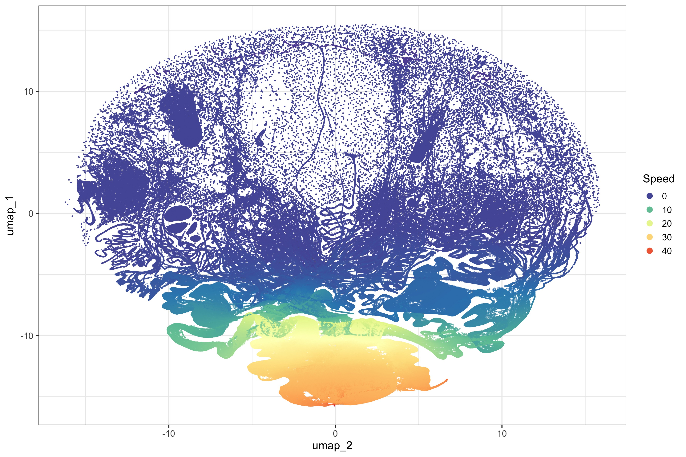<!-- -->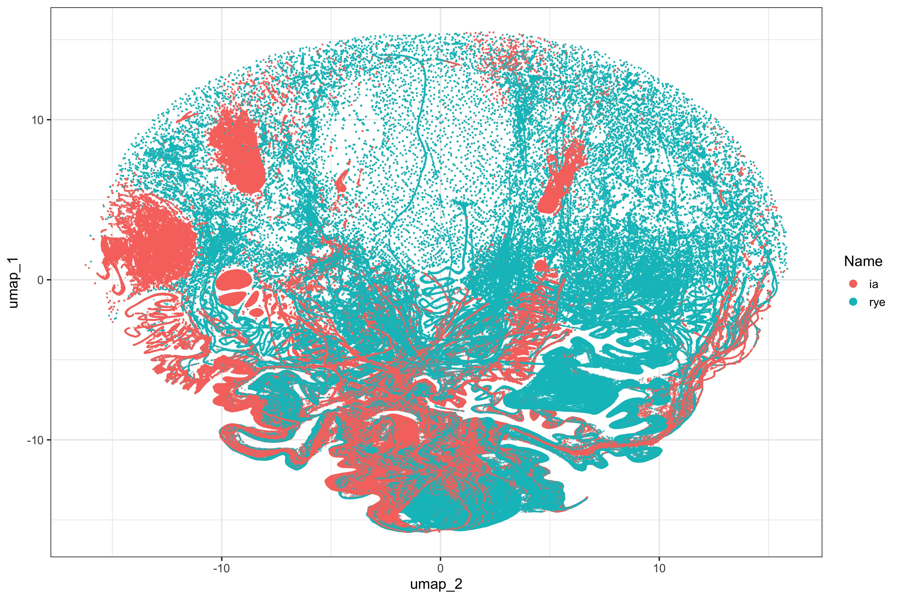<!-- -->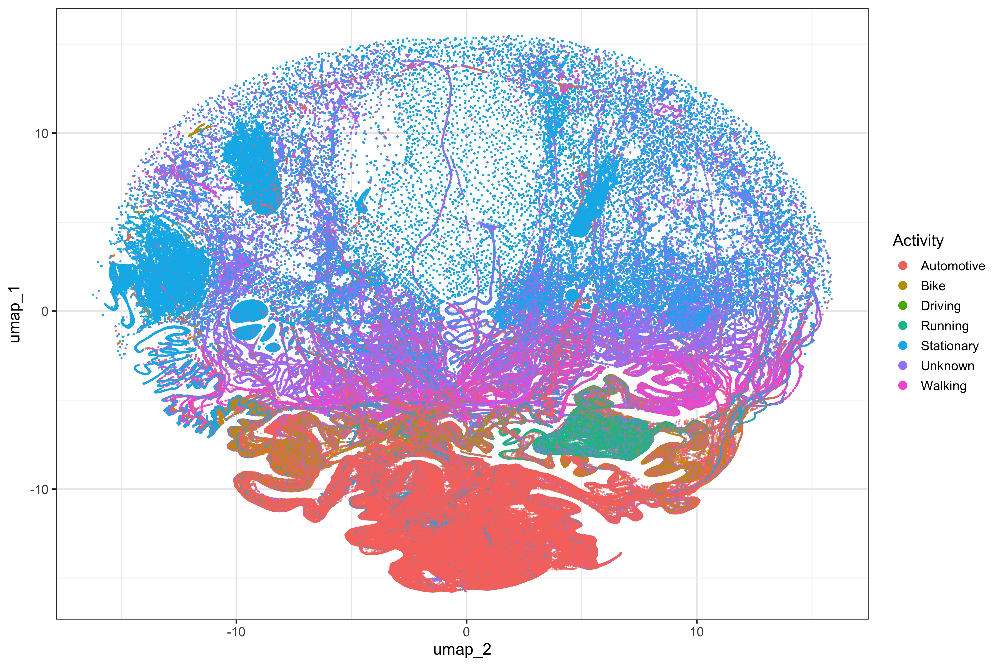<!-- -->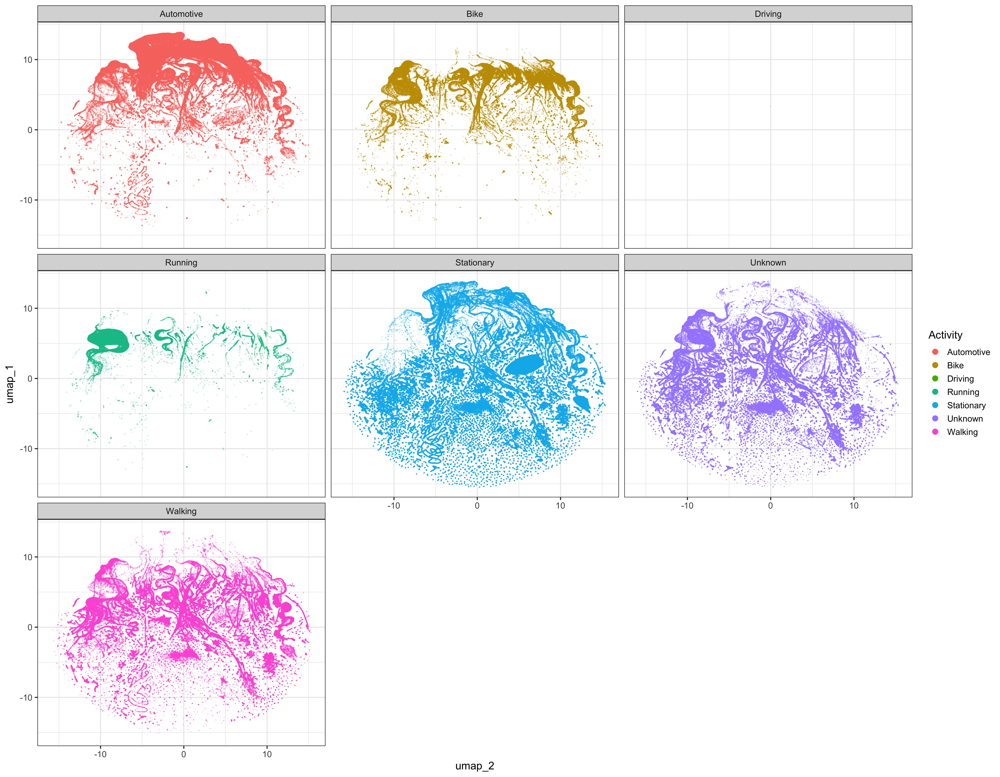<!-- -->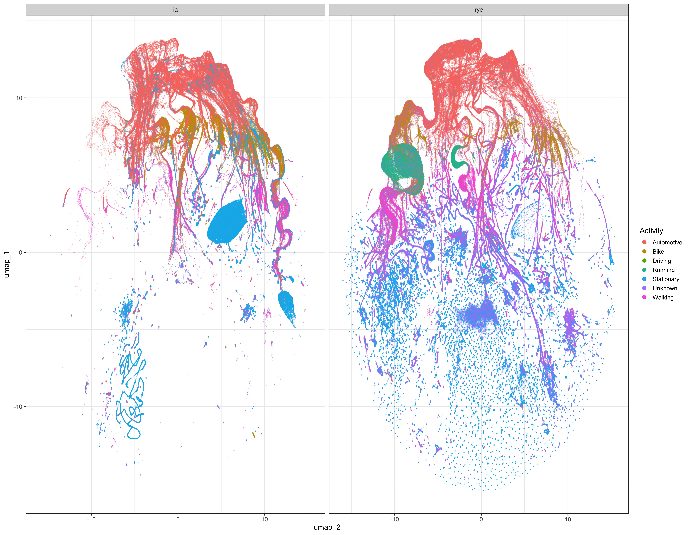<!-- -->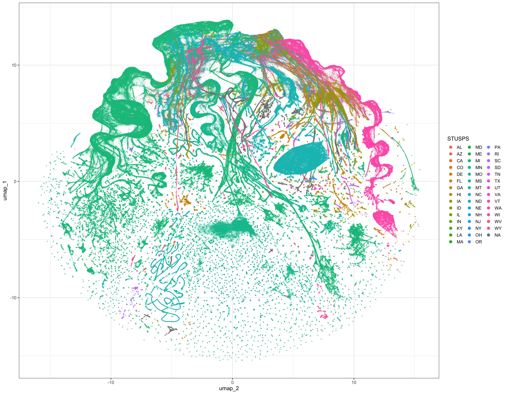<!-- -->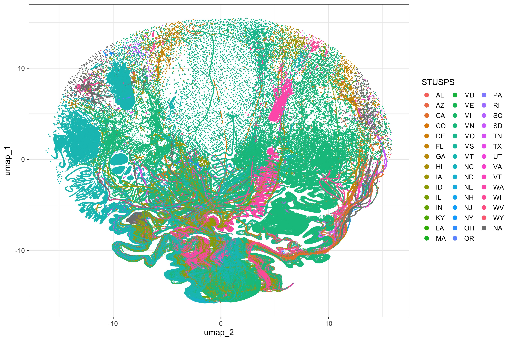<!-- -->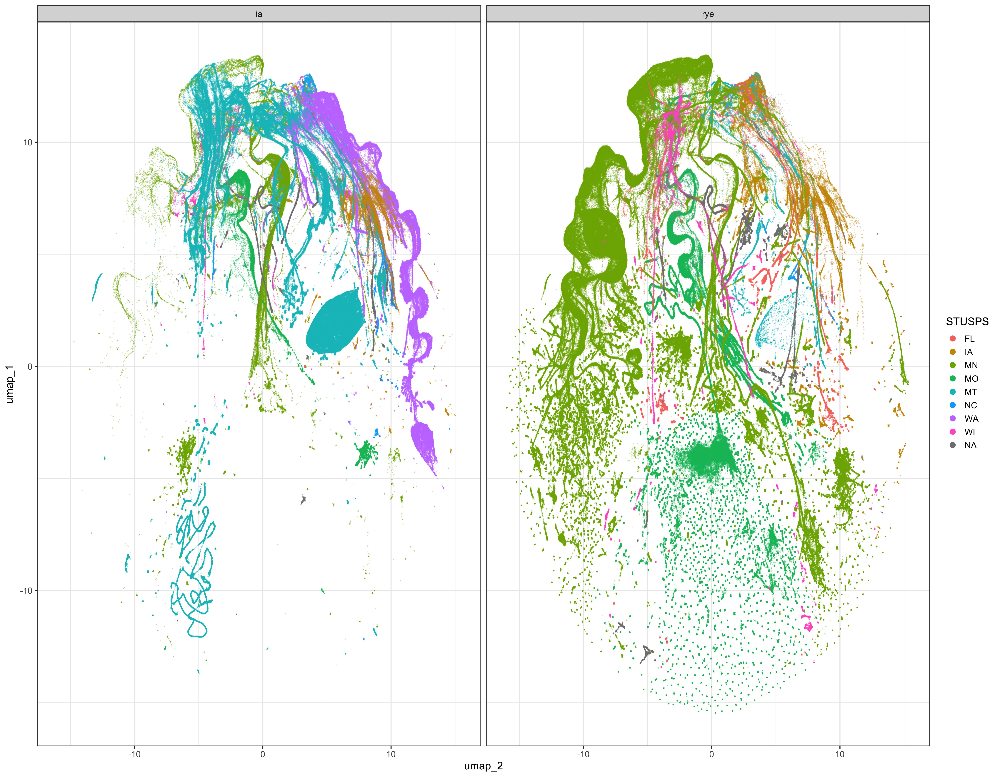<!-- -->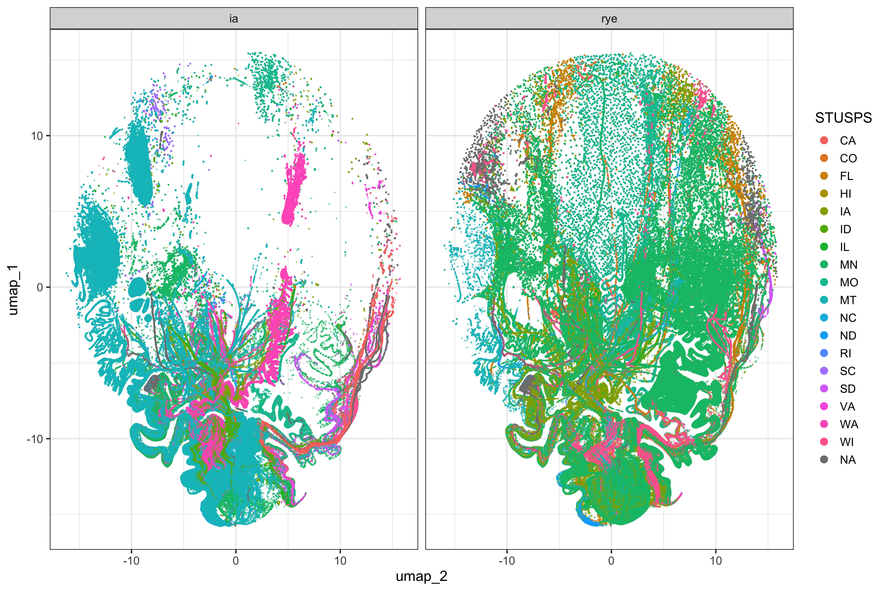<!-- -->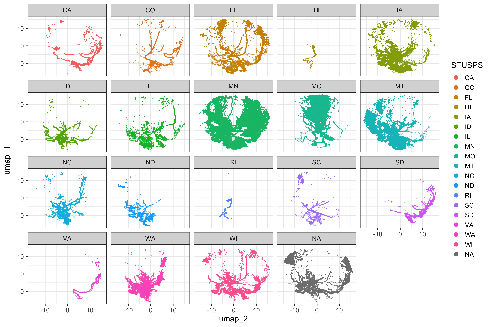<!-- -->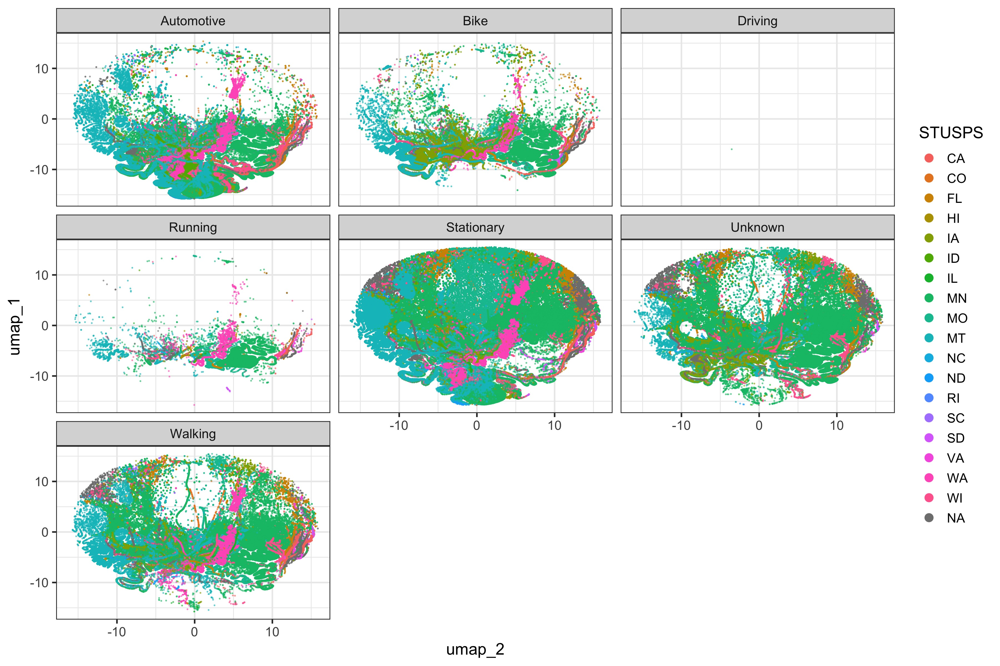<!-- -->
